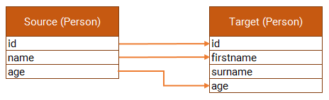
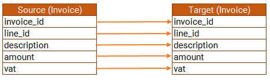

# DataRecordComparison

Compare two lists for attribute differences and missing records

## Acceptance Criteria

- A record is deemed EQUAL when the id column matches and the mapped attributes match are equal.
- A record is deemed MISMATCHED when the id column matches but one or more mapped attributes are not equal.
- A record is deemed SOURCE_UNMATCHED when the id column value is not found in the target list.
- A record is deemed TARGET_UNMATCHED when the id column value is not found in the source list.

### [Lists with a single long id attribute](- "basic")

Give a file of people [source-persons.csv](- "#source") and another file of people [target-persons.csv](- "#target")

When the system compares the lists

Then the following is found:

| [ ][compare] [ID][person_id]| [Type][type]       | [Name][name]  | [Age][age]
|-----------------------------|--------------------|---------------|-----------|
| 1                           | MISMATCH           | Mark (Marcus) | 42 (43)   |
| 2                           | MISMATCH           | Natasja       | 41 (42)   |
| 3                           | SOURCE_UNMATCHED   | Dillon        | 16        |
| 4                           | TARGET_UNMATCHED   | Crystal       | 15        |
| 5                           | TARGET_UNMATCHED   | Katie         | 5         |
| 6                           | EQUAL              | Shadow        | 5         |

[compare]: - "c:verify-rows=#result:compare(#source,#target)"
[person_id]: - "?=#result['ID']"
[type]: - "?=#result['resultType']"
[name]: - "?=#result['FIRSTNAME']"
[age]: - "?=#result['AGE']"

### [Read source invoice](- "readSourceInvoice")

Given a file of invoices [source-invoice.csv](- "#source")

When the system reads the data

Then the following data records are present:

| [ ][read] [Invoice Id][id]         | [Line Id][line]              | [Description][description] | [Amount][amount] | [Vat][vat]
|------------------------------------|------------------------------| ---------------------------|------------------|-----------
| 1                                  | 1                            | Dell Inspiron 3000 i5      | 8000.0           | true
| 1                                  | 2                            | HP Mouse                   | 400.0            | true
| 1                                  | 3                            | Samsung SHD Monitor        | 15000.0          | true
| 2                                  | 1                            | Dell Inspiron 3000 i3      | 6000.0           | true

[read]: - "c:verify-rows=#result:readSource(#source)"
[id]: - "?=#result['invoice_id']"
[line]: - "?=#result['line_id']"
[description]: - "?=#result['description']"
[amount]: - "?=#result['amount']"
[vat]: - "?=#result['vat']"

### [Lists with a compound id attribute](- "compound")

Give a file of invoices [source-invoice.csv](- "#source") and another file of invoices [target-invoice.csv](- "#target")

When the system compares the lists

Then the following is found:

| [ ][compound] [Invoice Id][id]      | [Line Id][line] | [Type][type]       | [Description][description]       | [Amount][amount] | [VAT][vat]
|----------------------|--------------|--------------------|----------------------------------|------------------|--------------|
| 1                    | 1            | MISMATCH           | Dell Inspiron 3000 i5 (Dell Insperon 3000 i5)       | 8000.0           | true (false) |  
| 1                    | 2            | MISMATCH           | HP Mouse (Hewlett-Packard Mouse)                    | 400.0 (450.0)    | true         |
| 1                    | 3            | MISMATCH           | Samsung SHD Monitor (Samsung Super HD Monitor)	     | 15000.0          | true         |
| 2                    | 1            | MISMATCH           | Dell Inspiron 3000 i3 (Dell Inspiron 3000 i7)       | 6000.0           | true         |

[compound]: - "c:verify-rows=#result:compoundCompare(#source,#target)"
[id]: - "?=#result['invoice_id']"
[line]: - "?=#result['line_id']"
[type]: - "?=#result['resultType']"
[description]: - "?=#result['description']"
[amount]: - "?=#result['amount']"
[vat]: - "?=#result['vat']"

